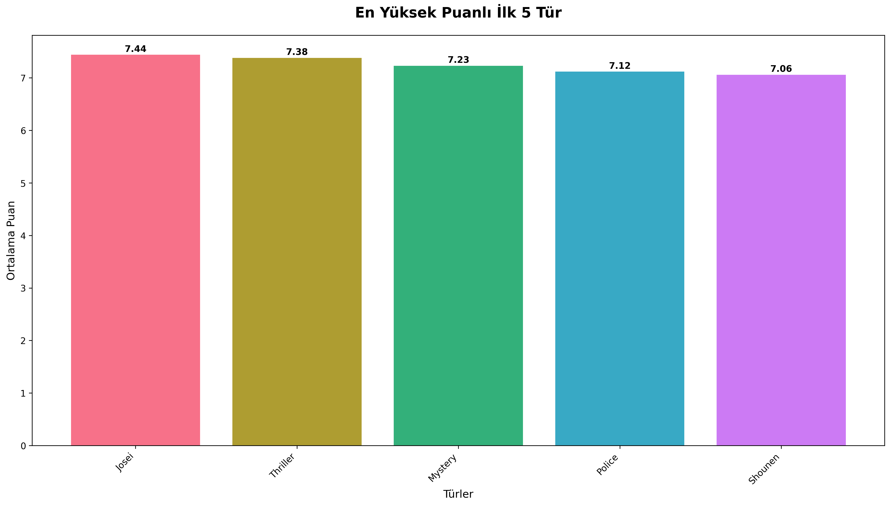
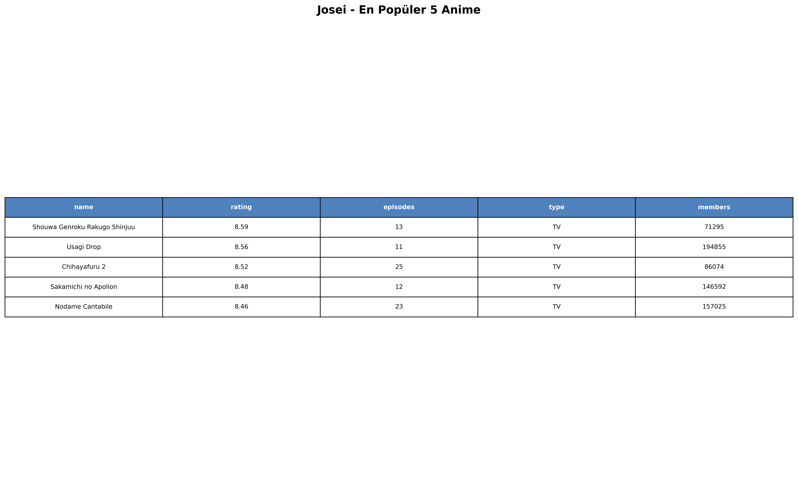
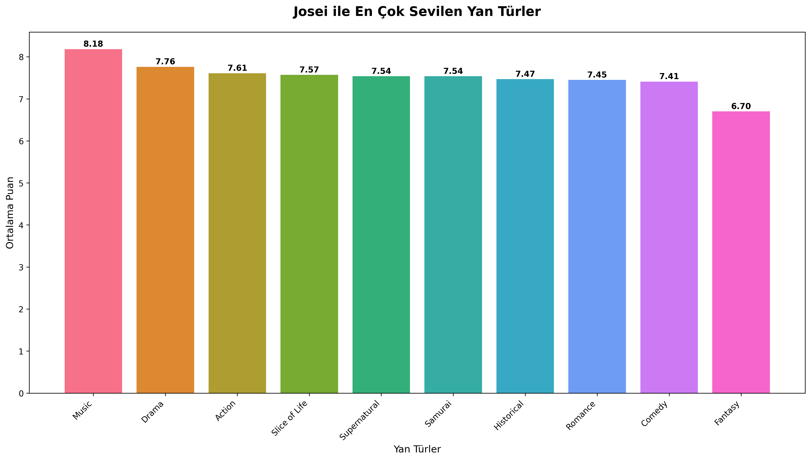
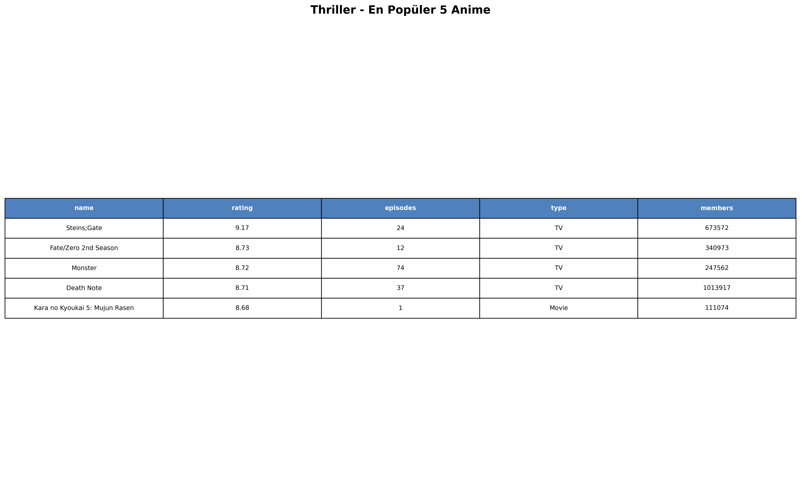
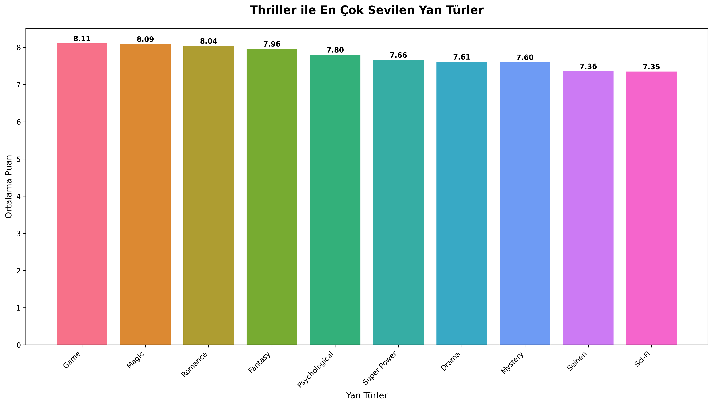
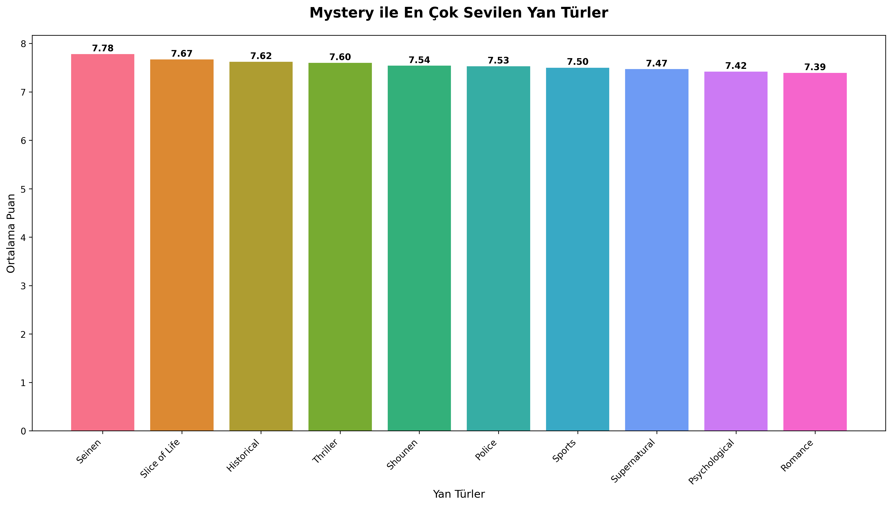
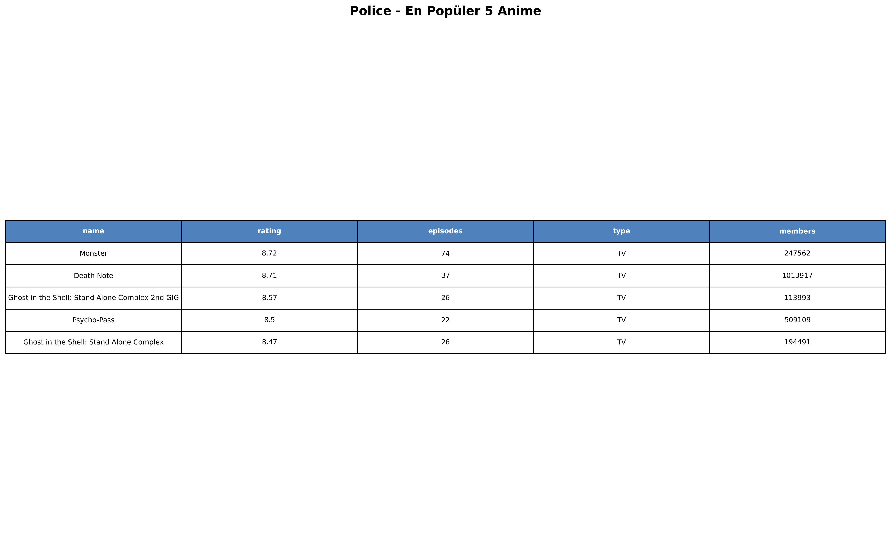
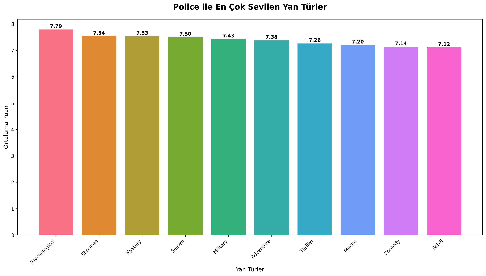
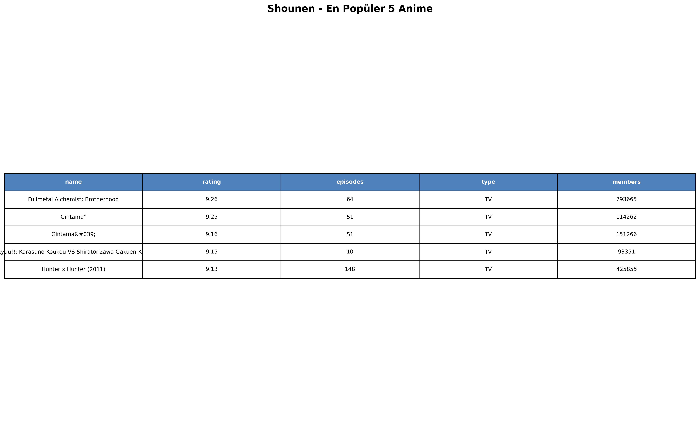
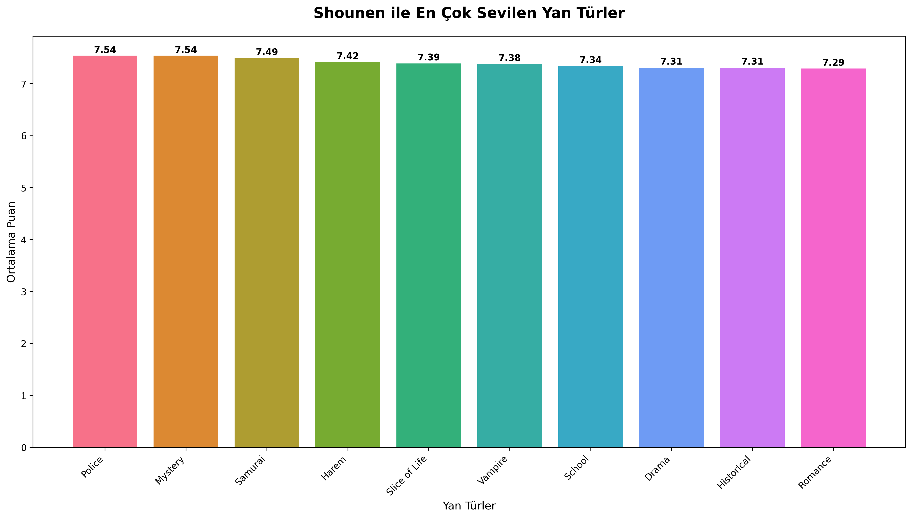

# 🎯 Anime Tür Analiz Raporu

**Analiz Tarihi:** 2025-09-10 03:28:44  
**Toplam Anime Sayısı:** 12,017  
**Toplam Tür Sayısı:** 43  

## 📊 Executive Summary

Bu rapor, anime türlerinin popülerlik ve puan dağılımlarını analiz etmektedir. Analiz şu bileşenleri içerir:
- En yüksek puanlı türler
- Her tür için en popüler animeler
- Tür kombinasyonları analizi
- Yan tür önerileri

## 🏆 En Yüksek Puanlı Türler

| Tür | Ortalama Puan | Anime Sayısı |
|---|---|---|
| Josei | 7.44 | 52 |
| Thriller | 7.38 | 86 |
| Mystery | 7.23 | 485 |
| Police | 7.12 | 195 |
| Shounen | 7.06 | 1684 |



## 🎬 Detaylı Tür Analizleri

### 1. Josei

#### 🎞️ Josei Türündeki En İyi 5 Anime

| name | rating | episodes | type | members |
|---|---|---|---|---|
| Shouwa Genroku Rakugo Shinjuu | 8.59 | 13 | TV | 71295 |
| Usagi Drop | 8.56 | 11 | TV | 194855 |
| Chihayafuru 2 | 8.52 | 25 | TV | 86074 |
| Sakamichi no Apollon | 8.48 | 12 | TV | 146592 |
| Nodame Cantabile | 8.46 | 23 | TV | 157025 |



#### 🌟 Josei ile En İyi Kombinasyonlar

| Yan Tür | Ortalama Puan | Anime Sayısı |
|---|---|---|
| Music | 8.18 | 6 |
| Drama | 7.76 | 25 |
| Action | 7.61 | 9 |
| Slice of Life | 7.57 | 22 |
| Supernatural | 7.54 | 10 |
| Samurai | 7.54 | 7 |
| Historical | 7.47 | 13 |
| Romance | 7.45 | 23 |
| Comedy | 7.41 | 22 |
| Fantasy | 6.7 | 5 |



#### 🎭 Örnek Anime Önerileri

**Josei + Music kombinasyonu için öneriler:**  
- Sakamichi no Apollon
- Nodame Cantabile
- Nodame Cantabile Finale

**Josei + Drama kombinasyonu için öneriler:**  
- Shouwa Genroku Rakugo Shinjuu
- Chihayafuru 2
- Sakamichi no Apollon

**Josei + Action kombinasyonu için öneriler:**  
- Hakuouki Movie 2: Shikon Soukyuu
- Hakuouki Movie 1: Kyoto Ranbu
- Hakuouki Sekkaroku

---

### 2. Thriller

#### 🎞️ Thriller Türündeki En İyi 5 Anime

| name | rating | episodes | type | members |
|---|---|---|---|---|
| Steins;Gate | 9.17 | 24 | TV | 673572 |
| Fate/Zero 2nd Season | 8.73 | 12 | TV | 340973 |
| Monster | 8.72 | 74 | TV | 247562 |
| Death Note | 8.71 | 37 | TV | 1013917 |
| Kara no Kyoukai 5: Mujun Rasen | 8.68 | 1 | Movie | 111074 |



#### 🌟 Thriller ile En İyi Kombinasyonlar

| Yan Tür | Ortalama Puan | Anime Sayısı |
|---|---|---|
| Game | 8.11 | 6 |
| Magic | 8.09 | 6 |
| Romance | 8.04 | 8 |
| Fantasy | 7.96 | 6 |
| Psychological | 7.8 | 31 |
| Super Power | 7.66 | 3 |
| Drama | 7.61 | 32 |
| Mystery | 7.6 | 43 |
| Seinen | 7.36 | 15 |
| Sci-Fi | 7.35 | 15 |



#### 🎭 Örnek Anime Önerileri

**Thriller + Game kombinasyonu için öneriler:**  
- Death Parade
- Gyakkyou Burai Kaiji: Ultimate Survivor
- Gyakkyou Burai Kaiji: Hakairoku-hen

**Thriller + Magic kombinasyonu için öneriler:**  
- Mahou Shoujo Madoka★Magica
- Mahou Shoujo Madoka★Magica Movie 3: Hangyaku no Monogatari
- Mahou Shoujo Madoka★Magica Movie 2: Eien no Monogatari

**Thriller + Romance kombinasyonu için öneriler:**  
- Kara no Kyoukai 5: Mujun Rasen
- Kara no Kyoukai 7: Satsujin Kousatsu (Kou)
- Higashi no Eden

---

### 3. Mystery

#### 🎞️ Mystery Türündeki En İyi 5 Anime

| name | rating | episodes | type | members |
|---|---|---|---|---|
| Mushishi Zoku Shou 2nd Season | 8.88 | 10 | TV | 75894 |
| Suzumiya Haruhi no Shoushitsu | 8.81 | 1 | Movie | 240297 |
| Monogatari Series: Second Season | 8.8 | 26 | TV | 205959 |
| Mushishi Zoku Shou | 8.8 | 10 | TV | 101351 |
| Mushishi | 8.78 | 26 | TV | 300030 |


#### 🌟 Mystery ile En İyi Kombinasyonlar

| Yan Tür | Ortalama Puan | Anime Sayısı |
|---|---|---|
| Seinen | 7.78 | 42 |
| Slice of Life | 7.67 | 20 |
| Historical | 7.62 | 28 |
| Thriller | 7.6 | 43 |
| Shounen | 7.54 | 113 |
| Police | 7.53 | 76 |
| Sports | 7.5 | 3 |
| Supernatural | 7.47 | 158 |
| Psychological | 7.42 | 65 |
| Romance | 7.39 | 55 |



#### 🎭 Örnek Anime Önerileri

**Mystery + Seinen kombinasyonu için öneriler:**  
- Mushishi Zoku Shou 2nd Season
- Mushishi Zoku Shou
- Mushishi

**Mystery + Slice of Life kombinasyonu için öneriler:**  
- Mushishi Zoku Shou 2nd Season
- Mushishi Zoku Shou
- Mushishi

**Mystery + Historical kombinasyonu için öneriler:**  
- Mushishi Zoku Shou 2nd Season
- Mushishi Zoku Shou
- Mushishi

---

### 4. Police

#### 🎞️ Police Türündeki En İyi 5 Anime

| name | rating | episodes | type | members |
|---|---|---|---|---|
| Monster | 8.72 | 74 | TV | 247562 |
| Death Note | 8.71 | 37 | TV | 1013917 |
| Ghost in the Shell: Stand Alone Complex 2nd GIG | 8.57 | 26 | TV | 113993 |
| Psycho-Pass | 8.5 | 22 | TV | 509109 |
| Ghost in the Shell: Stand Alone Complex | 8.47 | 26 | TV | 194491 |



#### 🌟 Police ile En İyi Kombinasyonlar

| Yan Tür | Ortalama Puan | Anime Sayısı |
|---|---|---|
| Psychological | 7.79 | 20 |
| Shounen | 7.54 | 67 |
| Mystery | 7.53 | 76 |
| Seinen | 7.5 | 18 |
| Military | 7.43 | 16 |
| Adventure | 7.38 | 66 |
| Thriller | 7.26 | 8 |
| Mecha | 7.2 | 47 |
| Comedy | 7.14 | 108 |
| Sci-Fi | 7.12 | 71 |



#### 🎭 Örnek Anime Önerileri

**Police + Psychological kombinasyonu için öneriler:**  
- Monster
- Death Note
- Psycho-Pass

**Police + Shounen kombinasyonu için öneriler:**  
- Detective Conan Movie 06: The Phantom of Baker Street
- Detective Conan Movie 13: The Raven Chaser
- Detective Conan Movie 20: The Darkest Nightmare

**Police + Mystery kombinasyonu için öneriler:**  
- Monster
- Death Note
- Ghost in the Shell: Stand Alone Complex 2nd GIG

---

### 5. Shounen

#### 🎞️ Shounen Türündeki En İyi 5 Anime

| name | rating | episodes | type | members |
|---|---|---|---|---|
| Fullmetal Alchemist: Brotherhood | 9.26 | 64 | TV | 793665 |
| Gintama° | 9.25 | 51 | TV | 114262 |
| Gintama&#039; | 9.16 | 51 | TV | 151266 |
| Haikyuu!!: Karasuno Koukou VS Shiratorizawa Gakuen Koukou | 9.15 | 10 | TV | 93351 |
| Hunter x Hunter (2011) | 9.13 | 148 | TV | 425855 |



#### 🌟 Shounen ile En İyi Kombinasyonlar

| Yan Tür | Ortalama Puan | Anime Sayısı |
|---|---|---|
| Police | 7.54 | 67 |
| Mystery | 7.54 | 113 |
| Samurai | 7.49 | 35 |
| Harem | 7.42 | 50 |
| Slice of Life | 7.39 | 79 |
| Vampire | 7.38 | 23 |
| School | 7.34 | 225 |
| Drama | 7.31 | 231 |
| Historical | 7.31 | 66 |
| Romance | 7.29 | 180 |



#### 🎭 Örnek Anime Önerileri

**Shounen + Police kombinasyonu için öneriler:**  
- Detective Conan Movie 06: The Phantom of Baker Street
- Detective Conan Movie 13: The Raven Chaser
- Detective Conan Movie 20: The Darkest Nightmare

**Shounen + Mystery kombinasyonu için öneriler:**  
- Detective Conan Movie 06: The Phantom of Baker Street
- Kuroshitsuji: Book of Murder
- Detective Conan Movie 13: The Raven Chaser

**Shounen + Samurai kombinasyonu için öneriler:**  
- Gintama°
- Gintama&#039;
- Gintama Movie: Kanketsu-hen - Yorozuya yo Eien Nare

---

## 📈 İstatistiksel Özet

| Metric | Value |
|---|---|
| Toplam Anime | 12,017 |
| Toplam Tür | 43 |
| En Yüksek Puan | 7.44 |
| En Düşük Puan | 5.01 |
| Ortalama Puan | 6.73 |
| Standart Sapma | 0.42 |

## 🔍 Metodoloji

1. **Veri Temizleme:** Eksik ve geçersiz veriler kaldırıldı
2. **Tür Ayrıştırma:** Virgülle ayrılmış türler bireysel kayıtlara dönüştürüldü
3. **İstatistiksel Analiz:** Her tür için ortalama puan ve sayımlar hesaplandı
4. **Kombinasyon Analizi:** Türler arası ilişkiler incelendi
5. **Görselleştirme:** Grafikler ve tablolar oluşturuldu

## 🎉 Sonuç

Bu analiz, anime türlerinin performansını ve birbirleriyle olan etkileşimlerini anlamak için kapsamlı bir bakış sunmaktadır. En yüksek puanlı türler ve bunların en iyi kombinasyonları, anime öneri sistemleri için değerli bilgiler sağlamaktadır.

---

*Bu rapor otomatik olarak oluşturulmuştur. Son güncelleme: 2025-09-10 03:28:44*  

### 📁 Dosya Yapısı
```
./anime_analysis_output_2025-09-10_03-28-44/
├── charts/                 # Grafikler (PNG)
├── tables/                 # Tablo görselleri (PNG)
├── text_reports/           # Metin raporları (TXT)
├── anime_lists/            # Anime listeleri (TXT)
└── comprehensive_report.md # Bu rapor
```